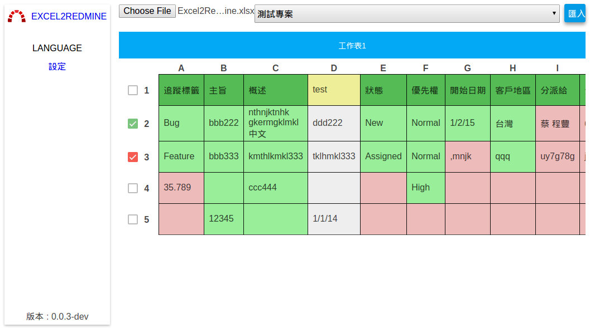

Excel2Redmine
=============

[Excel2Redmine]: http://tsaikd.org/Excel2Redmine/
[Redmine]: http://www.redmine.org/
[Redmine CORS]: http://www.redmine.org/plugins/redmine_cors

[Excel2Redmine][] is a web tool for importing excel data to [Redmine][]

## Requirement

* [Redmine][] 2.5.3
* [Redmine CORS][] Plugin

## Redmine setup

* Enable REST web service and JSONP
	* Administration -> Settings -> Authentication
		* check `Enable REST web service`
		* check `Enable JSONP support`
* Install [Redmine CORS][] Plugin
	* See [official wiki](http://www.redmine.org/projects/redmine/wiki/Plugins) for more information

## Excel2Redmine Usage

* See [the document](doc/userguide.md) for more information

## Screenshot

