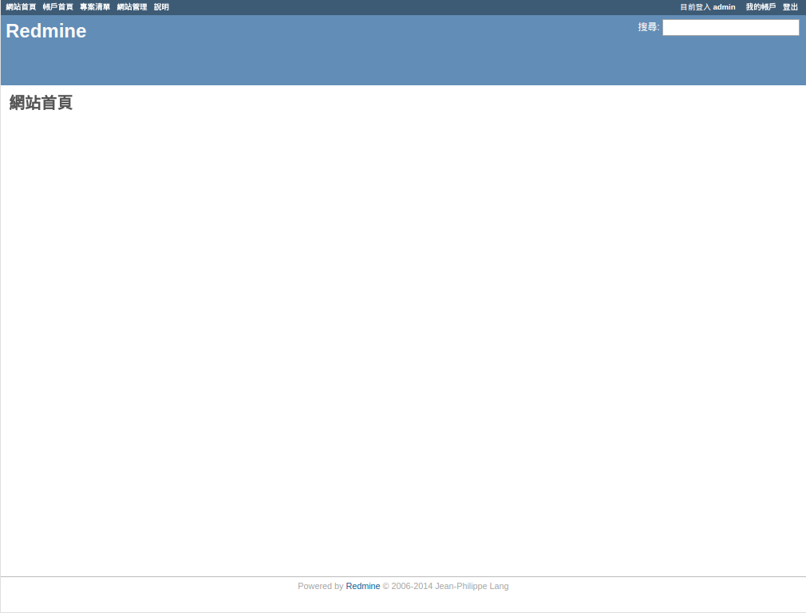
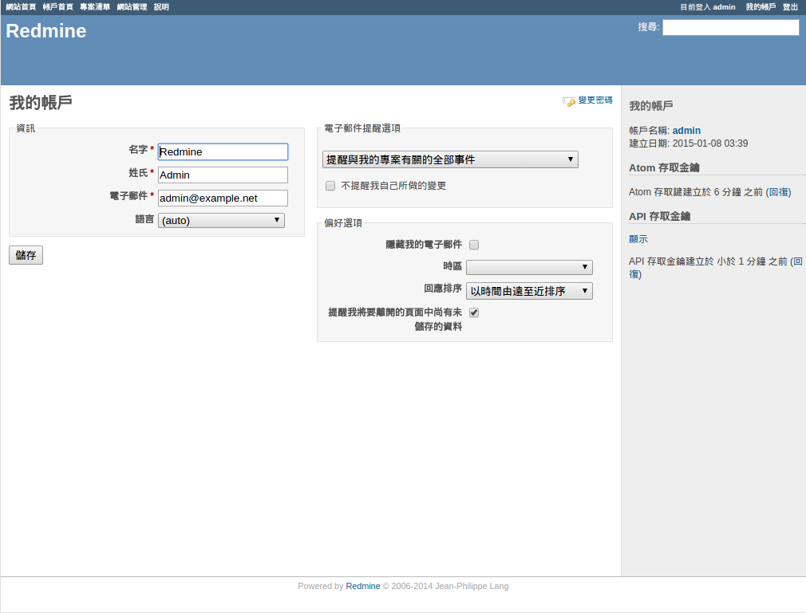
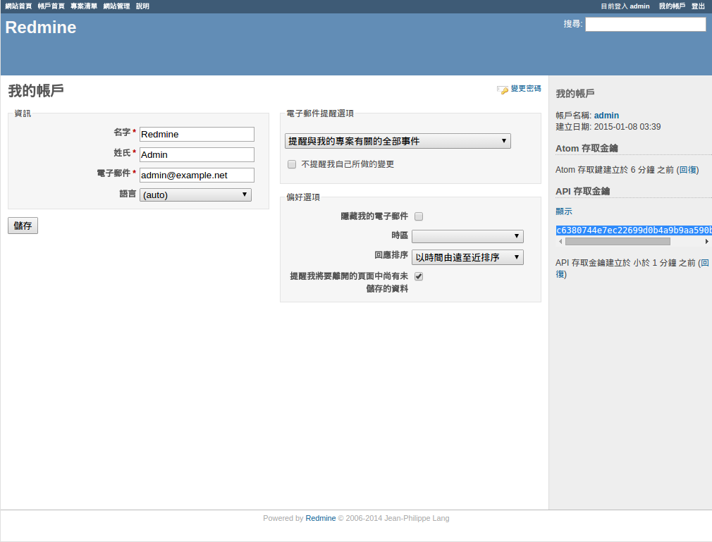

Excel2Redmine User Guide
========================

[Excel2Redmine]: http://tsaikd.org/Excel2Redmine/
[Redmine]: http://www.redmine.org/

The document describe how to use [Excel2Redmine][]

## Config

* Redmine URL

First, you should tell [Excel2Redmine][] where is your [Redmine][] system.
So fill `Redmine URL` with your [Redmine][] system URL.

E.g.

>* http://redmine.my.company.com
>* http://192.168.1.1

* API Key

Every user in [Redmine][] system should have a API Key.
Find it from your [Redmine][] system by the following steps:

1. Open your browser to visit your [Redmine][] system
	
2. Click `My account` link, e.g. http://redmine.my.company.com/my/account
	
3. Look for `API access key` in the right hand side panel
4. Click `Show` link
	
5. Copy the `API Key`, it is a hash like `c6380744e7ec22699d0b4a9b9aa590bfbbe192d6`
6. Paste to [Excel2Redmine][] Config `API Key` field
	

## Select excel file and import into Redmine

After configuration, you can use the tool now.

1. Open your browser to [Excel2Redmine][]
2. Select project which you want to import issues
	* if you are using at first time, try to reload the web to get the latest project list when project list is incorrect
3. Select excel file from your disk
	* or download xlsx file from [this Google Doc sample](https://docs.google.com/spreadsheets/d/1_MWLOIKyQRrqc0kyuWRmSbmpXdv12c5ciAp-N9fdQ7o/edit?usp=sharing)
4. Check excel content is in correct form
	* first row is headers
		* valid header will display in `GREEN` background
		* invalid header will display in `YELLOW` background and ignore
	* data start from second row
		* valid data will display in `GREEN` background
		* invalid data will display in `PINK` background
		* warning data will display in `YELLOW` background, this case is occurring when field accepted data is different from parsed data, e.g. `% Done` field expected a integer, but excel input a float like 45.5
5. Click `Import` to start to import data into your Redmine
	* each row will import as a issue
	* row with any invalid data will skip
6. Import result will display at the left hand side of excel
	* success imported row will check the box in `GREEN` background
	* failure imported row will check the box in `RED` background
